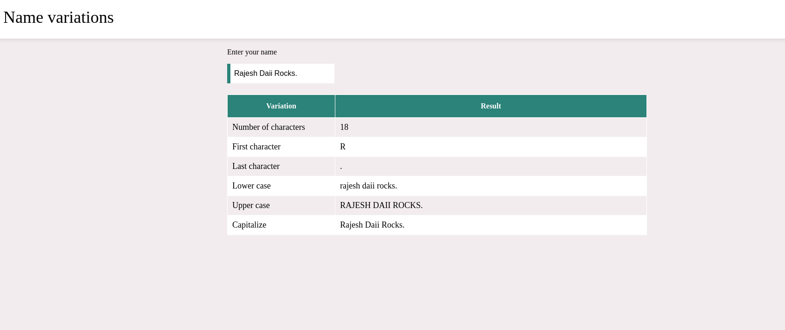

# Name-Varitation-Project
# Learnings
During this exploration, I encountered several interesting concepts and features of JavaScript:

1. **Functions as First-Class Citizens**: JavaScript treats functions as first-class citizens, allowing them to be assigned to variables, passed as arguments to other functions, and returned as values from other functions. This functional programming paradigm enables powerful and flexible coding patterns.

2. **Asynchronous Programming with Promises**: Asynchronous programming is inherent to JavaScript, and Promises provide a clean and intuitive way to handle asynchronous operations. By leveraging Promises, developers can write asynchronous code that is easier to read, write, and maintain.

3. **Arrow Functions**: Arrow functions are a concise syntax for writing anonymous functions in JavaScript. They provide a more compact and expressive way to define functions, especially for short, one-line functions.

4. **ES6 Features**: ECMAScript 6 (ES6) introduced several new features and enhancements to JavaScript, including arrow functions, template literals, destructuring assignment, and the `let` and `const` keywords. These features enhance the readability, maintainability, and expressiveness of JavaScript code.

# Project ScreenShor:

