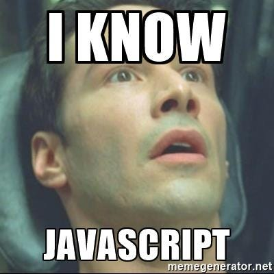

# Js
Let's see what's so special about this language. ( Damnn it's good)
# JavaScript Language Exploration

## Introduction
JavaScript, often abbreviated as JS, is a high-level, interpreted programming language that conforms to the ECMAScript specification. It is primarily used for building dynamic and interactive web pages. However, its scope extends beyond the web, with applications ranging from server-side development to mobile app development.
( yeah I used Chatgpt to make this )

## Conclusion
This exploration of JavaScript has been both enlightening and rewarding. JavaScript's flexibility, versatility, and ubiquity make it a fascinating language to explore further. I look forward to applying my learnings from this exploration to future projects and endeavors.
